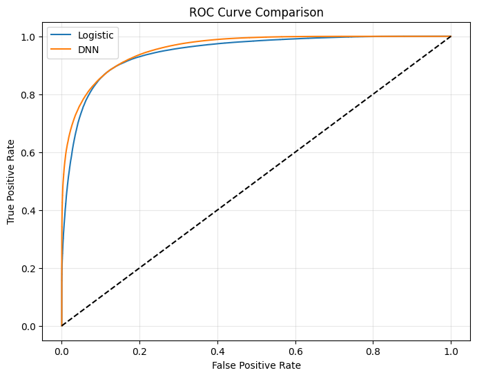
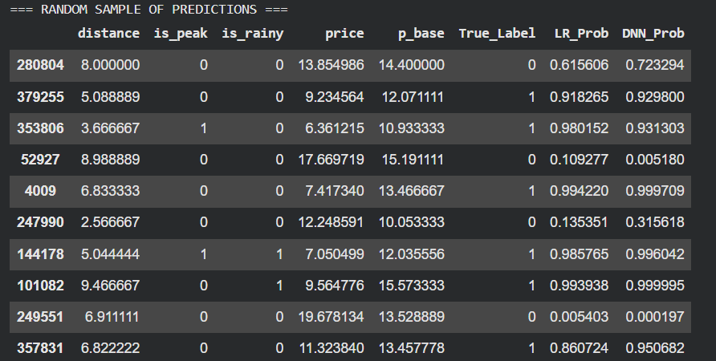

# Context-Aware Revenue Optimization  
### Dynamic Pricing for Food Delivery Using Deep Learning  

**Abdulrahman Jaber Ageeli**  
February 2026  

---

# 🚀 Quick Summary

This project builds a **dynamic pricing system** for food delivery platforms.

Instead of using fixed delivery fees, we simulate customer behavior under different pricing scenarios and train machine learning models to:

- Predict order acceptance probability  
- Model nonlinear price sensitivity  
- Identify the revenue-maximizing delivery price  

📈 Result: A Deep Neural Network improves predictive performance and enables more accurate revenue optimization compared to Logistic Regression.

---

# 💼 Business Problem

Delivery platforms face a fundamental trade-off:

- Higher price → higher margin  
- Higher price → lower probability of acceptance  

The goal is to maximize expected revenue:

$$
Revenue = price \times P(accept)
$$

To estimate $P(accept)$, we combine contextual feature engineering with nonlinear machine learning.

---

# 🧠 What This Project Does

1. Builds structured contextual features (distance, peak time, simulated weather)
2. Constructs an economically consistent stochastic demand simulator
3. Generates counterfactual pricing scenarios
4. Trains:
   - Logistic Regression (baseline)
   - Deep Neural Network (nonlinear model)
5. Evaluates models using:
   - ROC-AUC
   - Brier Score
   - Revenue optimization curve

---

# 📊 Results

| Model | AUC | Brier Score |
|-------|------|------------|
| Logistic Regression | ~0.945 | ~0.091 |
| Deep Neural Network | ~0.957 | ~0.084 |

### Key Takeaways

- Deep learning captures nonlinear elasticity effects.
- DNN improves probability calibration.
- The model identifies a clear revenue-maximizing price.
- No significant overfitting observed.

---

# 📷 Example Output

